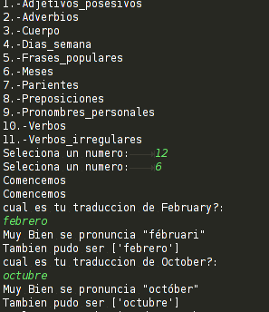

#Python Script y ejemplos

>#Script_palabras_Ingles
>> se encarga de preguntar cual de seria la traduccion de algunas palabras (que esta contenidas en un dicionario que contiene listas ver el archivo traductor2)
 al idioma ingles.
#--

>#Factorial
>#Fibonaci
>#Numeros Primos
